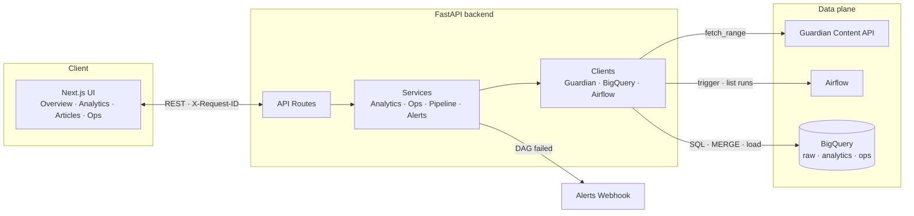

<div align="center">

# 📰 Press Intelligence

### Editorial analytics and pipeline operations for Guardian content flows

[](https://www.python.org)
[](https://fastapi.tiangolo.com)
[](https://nextjs.org)
[](https://www.typescriptlang.org)
[](https://airflow.apache.org)
[](https://cloud.google.com/bigquery)

[](https://docs.docker.com/compose/)
[](https://tailwindcss.com)
[](https://recharts.org)
[](https://www.structlog.org)
[](https://tenacity.readthedocs.io)
[](https://github.com/astral-sh/uv)
[](https://docs.astral.sh/ruff/)
[](https://docs.pytest.org)

[](https://github.com/pradhankukiran/press-intelligence/commits/main)
[](https://github.com/pradhankukiran/press-intelligence/commits/main)
[](https://github.com/pradhankukiran/press-intelligence/issues)
[](LICENSE)

<sub>Ingest • Transform • Analyze • Observe — for Guardian editorial content at scale.</sub>

</div>

---

## ✨ Highlights

- **Next.js 16** frontend with date-range filters, article search, pagination, and Recharts analytics.
- **FastAPI** backend with structured JSON logging, request correlation, uniform error envelopes, and `/health/live` + `/health/ready` probes.
- **Airflow 2** DAGs for scheduled ingestion and manual backfills with dependency-aware materializations.
- **BigQuery** warehouse with parameterized SQL, MERGE-based upserts, and configurable quality checks.
- **Resilience:** tenacity retries with `Retry-After` honoring, idempotency keys, per-article validation, webhook alerts on DAG failure.
- **Mock mode** ships seeded data so the whole stack runs with zero credentials.

---

## 🗺 Architecture



---

## 🚀 Quick start

```bash
git clone https://github.com/pradhankukiran/press-intelligence.git
cd press-intelligence
cp .env.example .env         # defaults are mock-mode; no creds needed
docker compose up --build
```

| URL | What |
|---|---|
| http://localhost:3000 | Frontend (Overview · Analytics · Articles · Ops) |
| http://localhost:8000/docs | FastAPI OpenAPI docs |
| http://localhost:8080 | Airflow UI |

Keep `DATA_MODE=mock` in `.env` for a no-credentials demo. Switch to `bigquery` once you have a service account.

---

## 🧰 Local development without Docker

**Backend (Python 3.12 via [`uv`](https://github.com/astral-sh/uv)):**

```bash
cd backend
uv sync
uv run uvicorn press_intelligence.main:app --reload --port 8000
```

**Frontend (Node 20+):**

```bash
cd frontend
npm install
npm run dev
```

---

## 🔌 Real integrations

Point at live Guardian + BigQuery + Airflow by setting:

```env
DATA_MODE=bigquery
GUARDIAN_API_KEY=...
GOOGLE_CLOUD_PROJECT=...
GOOGLE_APPLICATION_CREDENTIALS=/app/secrets/<service-account>.json
BIGQUERY_LOCATION=US

AIRFLOW_BASE_URL=http://airflow-webserver:8080/api/v1
AIRFLOW_USERNAME=...
AIRFLOW_PASSWORD=...
```

**Bootstrap the warehouse** (creates datasets/tables and loads a first slice):

```bash
cd backend
set -a && source ../.env && set +a
uv run press-intelligence-bootstrap --days 3
```

---

## 🧪 Testing

```bash
cd backend
uv run python -m pytest --cov=press_intelligence
```

- 44+ backend tests (services, clients, routes contract, alerts, idempotency, validation)
- `respx` for HTTP mocking, `freezegun` for frozen-clock windows, `pytest-asyncio` throughout
- Frontend typecheck via `npx tsc --noEmit`, lint via `npm run lint`, build via `npm run build`

---

## 🩺 Observability

| Endpoint | Purpose |
|---|---|
| `GET /api/health/live` | Liveness — always 200 when the process is up |
| `GET /api/health/ready` | Readiness — 503 if BigQuery or Airflow is degraded |
| `GET /api/health` | Alias of `/health/ready` (back-compat) |
| `GET /docs` | OpenAPI docs with grouped tags and response schemas |

**Structured logging** via `structlog`. Knobs:

```env
LOG_LEVEL=INFO
LOG_FORMAT=console   # or json for observability backends
```

Every request is tagged with an `X-Request-ID` (accepted or minted), echoed on the response, and bound into every log line for that request. Errors always return:

```json
{ "code": "upstream_unavailable", "message": "...", "request_id": "..." }
```

Secrets (`api_key`, `password`, `authorization`, `credentials`, …) are redacted from logs by a processor, not by convention.

---

## 🛡 Resilience features

- **Tenacity retries** on Guardian + Airflow HTTP calls — exponential jitter, `Retry-After` honored on 429.
- **Idempotency** — send `X-Idempotency-Key` with `POST /api/ops/backfills`; replays return the original response.
- **Incremental ingest** — `run_recent_ingest` seeds its lower bound from `MAX(ingested_at)` watermark.
- **Materialization DAG** — downstream steps skip when a parent fails, each step reports per-step status.
- **Per-article validation** — malformed Guardian rows are partitioned and logged instead of failing the whole batch.
- **Webhook alerts** — set `ALERTS_WEBHOOK_URL` to be notified once per failed DAG run (deduped in-memory).
- **MERGE-based upserts** — pipeline run history merges via BQ MERGE instead of full-table rewrites.

---

## 🧱 Project structure

```text
press-intelligence/
├── backend/
│   ├── airflow/
│   │   ├── Dockerfile
│   │   └── dags/guardian_pipeline.py
│   ├── src/press_intelligence/
│   │   ├── api/            # FastAPI routes + middleware
│   │   ├── clients/        # BigQuery, Guardian, Airflow, retry helper
│   │   ├── core/           # config, logging, DI, idempotency
│   │   ├── models/         # Pydantic schemas (request/response + errors)
│   │   ├── services/       # analytics, ops, pipeline, alerts, mock store
│   │   ├── sql/            # parameterized queries + materializations
│   │   └── mock_data/      # seed JSON for mock mode
│   ├── tests/              # pytest + respx + freezegun
│   ├── pyproject.toml
│   └── Dockerfile
├── frontend/
│   └── src/
│       ├── app/            # Next.js App Router (/ /analytics /articles /ops)
│       ├── components/     # dashboard-app, articles-app
│       └── lib/            # api client, types
├── docker-compose.yml
└── .env.example
```

---

## 🧭 Tech stack

| Layer | Tools |
|---|---|
| **Frontend** | Next.js 16 · React 19 · TypeScript · Tailwind CSS · Recharts |
| **Backend** | Python 3.12 · FastAPI · Pydantic v2 · structlog · tenacity · httpx |
| **Data** | BigQuery · Guardian Content API |
| **Orchestration** | Apache Airflow 2 (LocalExecutor) |
| **Infra** | Docker Compose · PostgreSQL (Airflow metadata) |
| **Tooling** | `uv` · `ruff` · `pytest` · `respx` · `freezegun` |

---

## ⚠️ Caveats

- Mock-mode backfill state is in-memory and does not survive a restart.
- `docker compose` mounts `./secrets` at `/app/secrets`. Set `GOOGLE_APPLICATION_CREDENTIALS=/app/secrets/<file>.json` for the container; use a host-absolute path for local runs outside docker.
- Auth, rate limiting, and hardened CORS are intentionally out of scope today.

---

## 📜 License

MIT — see [LICENSE](LICENSE) (add one before publishing).

---

<div align="center">
<sub>Built with ❤️ for editorial analytics. Guardian content used under their <a href="https://open-platform.theguardian.com/">Open Platform</a> terms.</sub>
</div>
